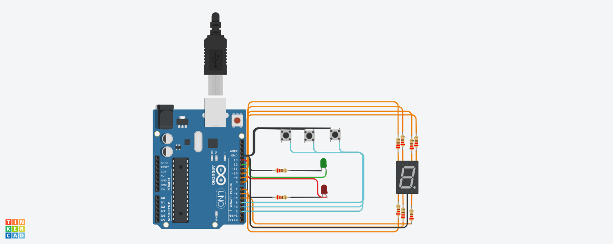

#   Parcial SPD montacargas

## Alumno
+ Alejandro Tomas falanga 

## Proyecto



## Descripcion del proyecto 

En este proyecto, mediante el uso de un arduino, tres botones, dos leds y un display 7 segmentos debemos de simular un montacargas de un hospital

## Funcionamiento

Cada elemento utilizado en el circuito cumple un rol especifico. El boton ubicado a la derecha sera el encargado de, al presioanarlo, dar la señal de subir de piso, el de la derecha dara la orden de descender un piso, en ambos casos, al estar en movimiento el led verde lo indicara encendindose. El boton del medio sera el encargado de hacer una parada de emergencia, haciendo que, en medio del recorrido, el montacargas quede en donde estaba. Al estar en parada de emeregencia, se notificara encendiendo el led rojo. El display 7 segmentos sera el encargado de indicar el piso en el que se encuentra el montacargas. 

## Funciones

```
void subeBaja(int Npiso)
{
	if(Npiso == 0)
    {
    	piso0();
    }
  	if (Npiso == 1)
    { 	
		piso1();
    }
  	if(Npiso == 2)
    {
      	piso2();
	}
	if(Npiso == 3)
	{
  		piso3();
	}
  	if(Npiso == 4)
	{
  		piso4();
	}
  	if(Npiso == 5)
	{
  		piso5();
	}
  	if(Npiso == 6)
	{
  		piso6();
	}
  	if(Npiso == 7)
	{
  		piso7();
	}
 	if(Npiso == 8)
	{
  		piso8();
	}
  	if(Npiso == 9)
	{
  		piso9();
    }
}


void piso0()
{	
  	apagar();
  	digitalWrite(b, HIGH);
  	digitalWrite(a, HIGH);
  	digitalWrite(e, HIGH);
  	digitalWrite(d, HIGH);
  	digitalWrite(f, HIGH);
  	digitalWrite(c, HIGH);
  	Serial.println("Usted esta en el piso 0");
}

void piso1()
{	
  	apagar();
  	digitalWrite(b, HIGH);
  	digitalWrite(c, HIGH);
  	Serial.println("Usted esta en el piso 1");
}

void piso2()
{
  	apagar();
  	digitalWrite(b, HIGH);
  	digitalWrite(a, HIGH);
  	digitalWrite(g, HIGH);
  	digitalWrite(d, HIGH);
  	digitalWrite(e, HIGH);	
  	Serial.println("Usted esta en el piso 2");
}

void piso3()
{
  	apagar();
	digitalWrite(b, HIGH);
  	digitalWrite(a, HIGH);
  	digitalWrite(g, HIGH);
  	digitalWrite(d, HIGH);
  	digitalWrite(c, HIGH);
  	Serial.println("Usted esta en el piso 3");
}

void piso4()
{
  	apagar();
  	digitalWrite(f, HIGH);
  	digitalWrite(g, HIGH);
  	digitalWrite(b, HIGH);
  	digitalWrite(c, HIGH);
  	Serial.println("Usted esta en el piso 4");
}

void piso5()
{
  	apagar();
	digitalWrite(a, HIGH);
  	digitalWrite(f, HIGH);
  	digitalWrite(g, HIGH);
  	digitalWrite(c, HIGH);
  	digitalWrite(d, HIGH);
  	Serial.println("Usted esta en el piso 5");
  	
}

void piso6()
{
  	apagar();
	digitalWrite(a, HIGH);
  	digitalWrite(f, HIGH);
  	digitalWrite(g, HIGH);
  	digitalWrite(c, HIGH);
  	digitalWrite(d, HIGH);
  	digitalWrite(e, HIGH);
  	Serial.println("Usted esta en el piso 6");
}

void piso7()
{
	apagar(); 	
	digitalWrite(b, HIGH);
	digitalWrite(a, HIGH);
	digitalWrite(c, HIGH);
  	Serial.println("Usted esta en el piso 7");
}
  
void piso8()
{	
  	apagar();
	digitalWrite(b, HIGH);
  	digitalWrite(a, HIGH);
  	digitalWrite(e, HIGH);
  	digitalWrite(d, HIGH);
  	digitalWrite(f, HIGH);
  	digitalWrite(c, HIGH);
  	digitalWrite(g, HIGH);
  	Serial.println("Usted esta en el piso 8");
}

void piso9()
{	
  	apagar();
	digitalWrite(b, HIGH);
  	digitalWrite(a, HIGH);
  	digitalWrite(d, HIGH);
  	digitalWrite(f, HIGH);
  	digitalWrite(c, HIGH);
  	digitalWrite(g, HIGH);
  	Serial.println("Usted esta en el piso 9");
}

void apagar()
{
	digitalWrite(b, LOW);
  	digitalWrite(a, LOW);
  	digitalWrite(e, LOW);
  	digitalWrite(d, LOW);
  	digitalWrite(f, LOW);
  	digitalWrite(c, LOW);
  	digitalWrite(g, LOW);
  	delay(200);
}

void limites()
{
  if(contador < 0)
  {
    contador = 0;
  }else if (contador > 9) 
  {
    contador = 9;
  }
```

## Cuerpo del loop

```
void loop()
{
  if(flag)
  {
    digitalWrite(rojo, LOW);
    limites();
  	if(contador == 0)
    {
     	digitalWrite(b, HIGH);
  		digitalWrite(a, HIGH);
  		digitalWrite(e, HIGH);
  		digitalWrite(d, HIGH);
  		digitalWrite(f, HIGH);
  		digitalWrite(c, HIGH);
    }
    switch(digitalRead(avanzar))
    {
      case 0:
      contador2 = contador;
      contador ++;
      digitalWrite(verde, HIGH);
      for(int i = 0; i<30; i++)
      {
        if(digitalRead(detener) == 0)
        {
          flag = false;
          break;
        }
        delay(100);
      }
      if(flag == false)
      {
        break;
      }
      subeBaja(contador);
      digitalWrite(verde, LOW);
    }
   switch (digitalRead(retroceder))
   {
    case 0:
    {
      contador2 = contador;
      contador = contador - 1;
      digitalWrite(verde, HIGH);
      for(int i = 0; i<30; i++)
      {
        if(digitalRead(detener) == 0)
        {
          flag = false;
          break;
        }
        delay(100);
      }
      if(flag == false)
      {
        break;
      }
      subeBaja(contador);
      digitalWrite(verde, LOW);
    }
   }
  }else 
  {
    contador = contador2;
    digitalWrite(verde, LOW);
    digitalWrite(rojo, HIGH);
    if(digitalRead(detener) == 0 && digitalRead(detener) != segundoValor)
    {
      	if(flag == false)
        {
    		flag = true;
        }
    }
    segundoValor = digitalRead(detener);
  }
}
```

# link al proyecto 

[Proyecto tinkercad](https://www.tinkercad.com/things/jbuxYvUg8KZ)